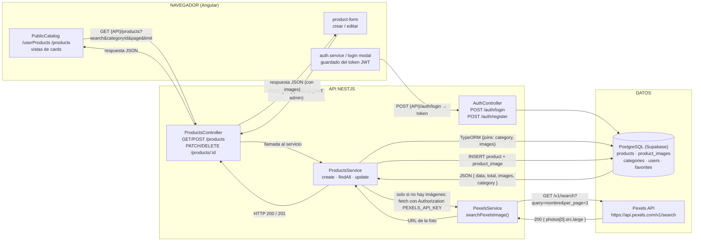
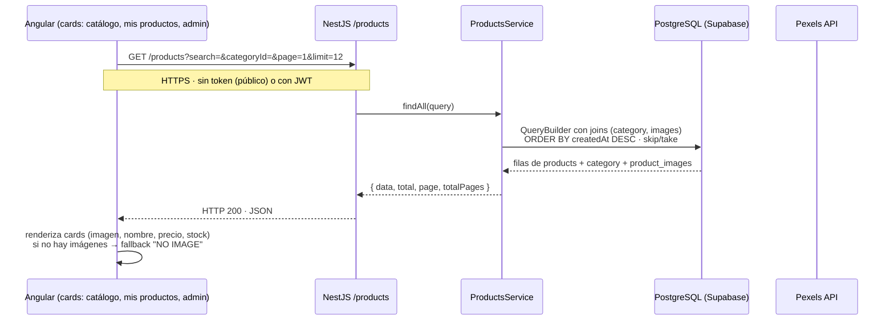
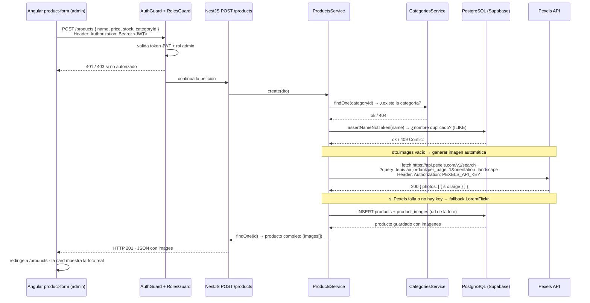

# Gestión de Productos CoreX

> **La plataforma moderna para administrar tu catálogo, tu inventario y tu experiencia de compra — todo en un solo lugar.**

CoreX es una aplicación full-stack de gestión de productos con una experiencia de doble cara: un **catálogo público** elegante para tus clientes y un **panel administrativo** potente para tu equipo. Diseñada para crecer con tu negocio, con imágenes automáticas, roles inteligentes y una interfaz que se siente premium en cada detalle.

---

## Cómo viaja la información de los productos

CoreX es un sistema de tres capas: el **cliente Angular** hace llamadas HTTPS a la **API NestJS**, la API consulta **PostgreSQL** y, cuando hace falta una imagen, llama a la **Pexels API**. Todo empieza con un **login JWT**: el cliente guarda el token y lo envía en cada petición protegida.



### Flujo de lectura (ver productos)



### Flujo de creación (con imagen automática)



---

## ¿Por qué CoreX?

- **Catálogo público de nivel comercial.** Tus clientes navegan, exploran y guardan favoritos sin necesidad de registrarse — con un login elegante que aparece justo cuando lo necesitan.
- **Imágenes automáticas con Pexels.** Crea un producto y CoreX busca y asigna una foto real según su nombre. Adiós a las cards vacías.
- **Roles inteligentes.** Un solo sistema, dos experiencias: usuarios con sus productos y favoritos; administradores con control total de productos, categorías y métricas.
- **Dashboard en tiempo real.** Métricas de inventario, categorías y valor estimado que te dicen cómo va tu negocio de un vistazo.
- **Interfaz cyberpunk.** Un diseño oscuro, tipográfico y distintivo que hace que tu catálogo destaque por encima de la competencia.

---

## Funcionalidades destacadas

### Para el usuario final
- Catálogo público con búsqueda, categorías y paginación.
- Favoritos con un solo clic (corazón) — sin necesidad de cuenta.
- Login modal integrado que no interrumpe la navegación.
- Vista personal "Mis productos" con buscador rápido.

### Para el administrador
- Gestión completa de productos: crear, editar, eliminar.
- Gestión de categorías.
- Dashboard con métricas de inventario y valor estimado.
- Control de perfil y cambio de contraseña.
- Panel con imagen automática del producto según su nombre.

### Sistema
- Autenticación JWT con roles `admin` y `user`.
- Roles administradores configurables por email (`ADMIN_EMAILS`).
- API REST documentada con Swagger.
- Base de datos PostgreSQL relacional (Supabase).

---

## Arquitectura

```
┌─────────────────────┐      ┌──────────────────────┐
│   Cliente Angular   │ HTTP │   API NestJS         │
│  (catálogo, panel)  │ ───► │  (auth, productos,   │
│                     │ ◄─── │   categorías, favs)  │
└─────────────────────┘      └──────────┬───────────┘
                                        │ TypeORM
                              ┌─────────▼───────────┐
                              │  PostgreSQL (Supabase)│
                              └──────────────────────┘
```

| Capa | Tecnología |
|------|------------|
| Frontend | Angular 22, RxJS, Angular Material de estilos propios (SCSS) |
| Backend | NestJS 11, TypeORM, Passport JWT, class-validator |
| Base de datos | PostgreSQL (Supabase) |
| Imágenes automáticas | Pexels API (con fallback a LoremFlickr) |
| Deploy | Vercel (frontend) · Render (API) |

---


## Roles de acceso

| Acción | Usuario | Administrador |
|--------|:------:|:-------------:|
| Ver catálogo público | Sí | Sí |
| Guardar favoritos | Sí | No |
| Ver "Mis productos" | Sí | — |
| Gestionar productos | No | Sí |
| Gestionar categorías | No | Sí |
| Ver dashboard | No | Sí |
| Configuración de perfil | Sí | Sí |

> El rol se asigna automáticamente al iniciar sesión: si el email está en `ADMIN_EMAILS`, el usuario es administrador.

---

## Estructura del proyecto

```
├── client/          # Aplicación Angular (catálogo público + panel)
│   └── src/app/
│       ├── core/          # Servicios, guards, interceptores, configuración
│       ├── features/      # Módulos: public-catalog, products, categories,
│       │                  #   favorites, auth, dashboard, settings, layout
│       ├── models/        # Modelos e interfaces
│       └── services/      # Servicios de API (productos, favoritos)
├── server/          # API REST NestJS
│   └── src/
│       ├── modules/       # auth, users, products, categories, favorites
│       ├── migrations/    # Esquema de base de datos
│       └── main.ts        # Bootstrap + Swagger
├── .github/workflows/     # CI (lint, build, tests)
└── vercel.json            # Configuración de deploy del frontend
```

---

## Despliegue

El proyecto está preparado para publicarse en la nube:

- **Frontend (Angular):** en Vercel, usando el `vercel.json` incluido (framework Angular, rewrites SPA incluidos).
- **Backend (NestJS):** en Render, apuntando la variable de entorno `DATABASE_URL` a tu PostgreSQL.

En producción, configura las mismas variables del `.env` en el panel de tu proveedor de hosting. El frontend en producción apunta automáticamente a `https://tolla-backend.onrender.com` (ajústalo en `client/src/app/core/config/api.config.ts` según tu dominio).

---

## Roadmap

- Carrito de compras y checkout.
- Pedidos y seguimiento de órdenes.
- Reportes avanzados de ventas.
- Soporte multiusuario con permisos granulares.

---

## Contribuir

1. Haz un fork del repositorio.
2. Crea tu rama: `git checkout -b feature/mi-mejora`.
3. Realiza tus cambios y haz commit.
4. Abre un Pull Request a la rama `develop`.

---

Hecho con el stack de productividad definitivo: **Angular + NestJS + PostgreSQL**.